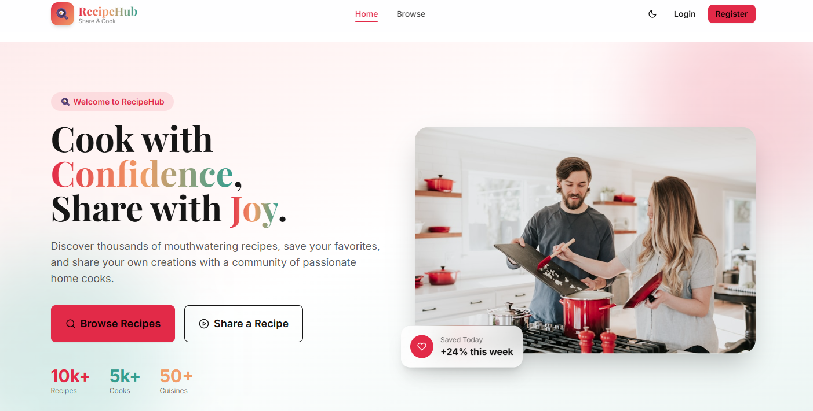

# RecipeHub Client

## 📖 Project Overview
The frontend for **RecipeHub** — a premium recipe sharing platform built with Vite, React, Tailwind CSS, DaisyUI, and Firebase authentication. It allows users to browse, search, like, rate, and purchase recipes while providing dedicated dashboards for authors and admins.

## 📸 Project Screenshot


## 💻 Tech Stack
- **Vite 6** + **React 18**
- **Tailwind CSS 3** + **DaisyUI 4**
- **React Router 7**
- **TanStack React Query 5**
- **Firebase** (Google sign-in)
- **Stripe Elements** for payments
- **Axios** (for API communication)

## ✨ Key Features
- 🔍 Browse, search, filter, sort, and paginate recipes
- ❤️ Like, favorite, rate, and report recipes
- 🔐 Email/password + Google sign-in (Firebase)
- 💳 Stripe Checkout for premium recipe purchases and membership
- 👨‍🍳 Author dashboard: add / edit / delete recipes
- 🛡️ Admin dashboard: users, recipes, reports, transactions
- 🌗 Dark / light theme toggle (persisted in localStorage)
- 📱 Fully responsive (mobile-first)
- ✨ Framer Motion animations throughout

## 📦 Dependencies
- `@stripe/react-stripe-js` & `@stripe/stripe-js`
- `@tanstack/react-query`
- `axios`
- `better-auth`
- `framer-motion`
- `lottie-react`
- `react`, `react-dom`
- `react-hook-form`
- `react-icons`
- `react-router-dom`
- `sonner`, `sweetalert2`

## 🛠️ Local Setup Guide

1. Clone the repository and navigate to the project directory:
   ```bash
   git clone <repository-url>
   cd recipehub-client
   ```
2. Install the required dependencies:
   ```bash
   npm install
   ```
3. Create a `.env` file in the root directory (you can copy from `.env.example`) and fill in your keys:
   ```bash
   cp .env.example .env
   ```
4. Start the development server:
   ```bash
   npm run dev
   ```
5. Open your browser and visit `http://localhost:5173`.

## 🌐 Live Links & Resources
- **Live Frontend (Vercel):** https://recipehub-client-gamma.vercel.app/
- **Backend API (Render):** https://recipehub-server-yach.onrender.com

### 🔐 Admin Credentials (for graders)
| Field | Value |
|-------|-------|
| Email | `admin@recipehub.com` |
| Password | `Admin@1234` |
> Login at the live URL above with these credentials to access the Admin Dashboard.
